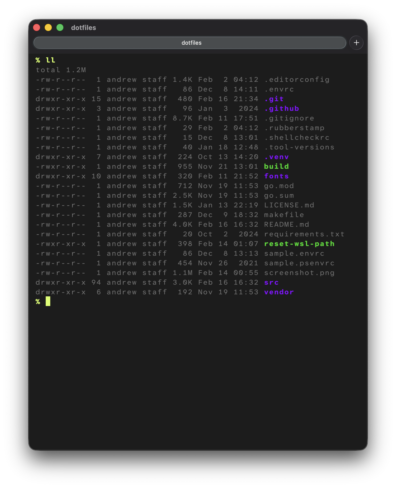

# Dotfiles: configuration files

[](https://github.com/mcandre/dotfiles/actions/workflows/lint.yml) [](LICENSE.md) [](https://github.com/sponsors/mcandre)



# ABOUT

Collection of configurations for safe, fast, software development.

# REQUIREMENTS

* a UNIX-like environment (e.g. [WSL](https://learn.microsoft.com/en-us/windows/wsl/))
* [asdf](https://asdf-vm.com/)
* [awk](https://pubs.opengroup.org/onlinepubs/9799919799/utilities/awk.html)
* [bash](https://www.gnu.org/software/bash/) 4+
* [EditorConfig](https://editorconfig.org/)
* [findutils](https://pubs.opengroup.org/onlinepubs/9799919799/utilities/find.html)
* [grep](https://pubs.opengroup.org/onlinepubs/9699919799.orig/utilities/grep.html)
* [make](https://pubs.opengroup.org/onlinepubs/9799919799/utilities/make.html)
* [Go](https://go.dev/)
* [Rust](https://rust-lang.org/)
* [ShellCheck](https://www.shellcheck.net/) 0.11.0+
* [zsh](https://www.zsh.org/)
* Provision additional dev tools with `make -f install.mk`

## Recommended

* [lessutils](https://www.greenwoodsoftware.com/less/)
* [mcandre/kickers](https://github.com/mcandre/kickers)

# WINDOWS TERMINAL

`~\AppData\Local\Packages\Microsoft.WindowsTerminal_8wekyb3d8bbwe\LocalState\settings.json`

# TASKS

We automate engineering tasks.

## Security Audit

```sh
make audit
```

## Lint

```sh
make
```
